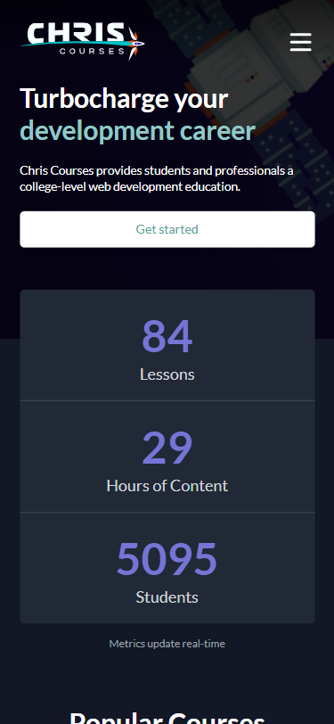
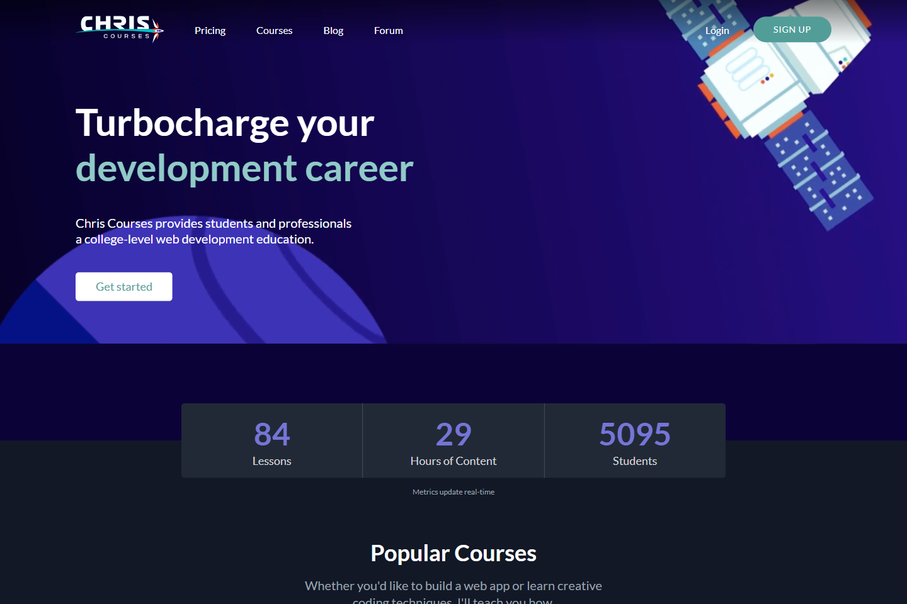

# 💻 Chris Courses Learning Platform

## ℹ️ A Multi-Section Responsive Landing Page

| _Mobile Preview (375x812)_                       | _Desktop Preview (1440x960)_                        |
| ------------------------------------------------ | --------------------------------------------------- |
|  |  |

A full landing page for an online course platform, built entirely with semantic HTML5 and custom CSS. This site mimics Tailwind UI-style layouts and practices real-world design structures.

---

## 🔍 Overview

This is a fully responsive, multi-section landing page inspired by Tailwind UI. Built from a Figma design using semantic HTML and custom CSS, the layout simulates a real-world course platform with clean structure and accessibility in mind.

This project served as a hands-on exercise in building complex layouts from scratch, deepening my understanding of responsive design, mobile-first development, and professional UI/UX patterns — all without using any frameworks.

---

## ✨ Features

- Responsive grid layout using Flexbox and CSS Grid
- Call-to-action buttons and links with hover states
- Dark theme with a strong visual hierarchy
- Pricing cards with most popular tag
- Metrics and statistics section using styled cards
- FAQ layout using semantic question-answer markup
- Testimonial block styled for clarity
- Mobile-first design and media queries
- CSS custom properties for maintainable theming
- Fully accessible structure with alt text and role attributes

---

## 🧠 What I Learned

- How to code a fully responsive website from a Figma design link
- How to structure multi-section landing pages with semantic HTML
- Advanced CSS techniques including variables, utility classes, and custom themes
- Mobile-first responsive design strategies
- Creating clean, scalable code with maintainability in mind
- Mimicking professional UI/UX layouts without frameworks
- Best practices in accessibility and visual hierarchy

---

## 🛠️ Tech Used

- HTML5
- CSS3
- Figma
- Git
- GitHub
- Netlify

---

## 🚀 How to Run

1. Clone the repository
2. Open `index.html` in your browser

---

## 🌐 Live Demo

Or you can check out the 👉 [live website here](https://chris-courses-jiro.netlify.app/)

---

## 🧑‍💻 Author

Created by **Elmar Chavez**

🗓️ Month/Year: **May 2025**

📚 Journey: **2nd** month of learning _frontend web development_.
